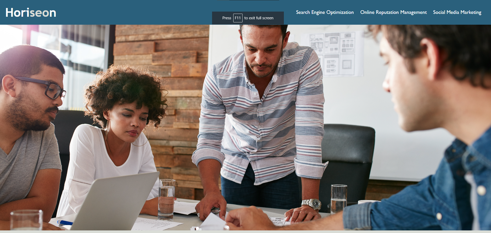

# Horiseon: Preparing For Success!

#### Starting off the Bootcamp with Week One's Odd-number Challenge: 
Our assignment for Week One is to take the already-completed html/css project and improve the formatting and accessibility of said files.

## Link To Website
[Click here to be re-directed!](https://callbeyond.github.io/HoriseonWebpage/ "Click here to visit Horiseon!")

## Usage
Right click the website and inspect the HTML and CSS code! 

## Screenshots

## Credits

UofM-VIRT-FSF-PT-10-2023-U-LOLC-ENTG
## License

[MIT](https://choosealicense.com/licenses/mit/)